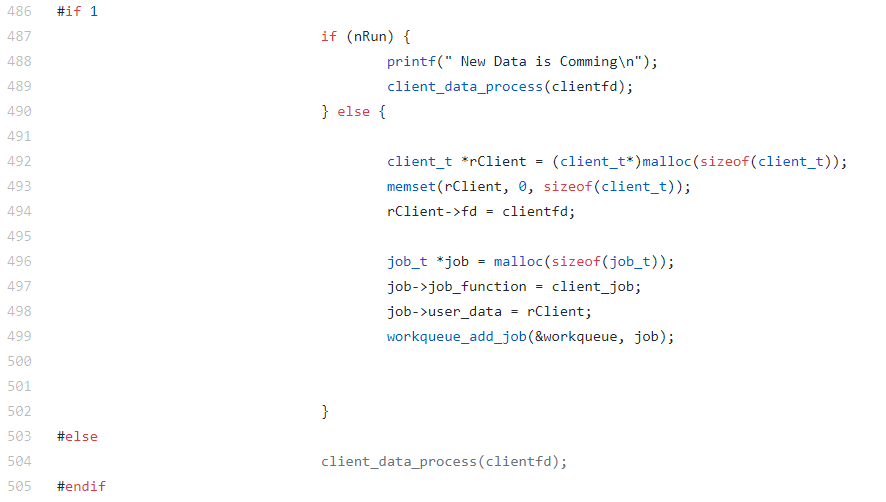
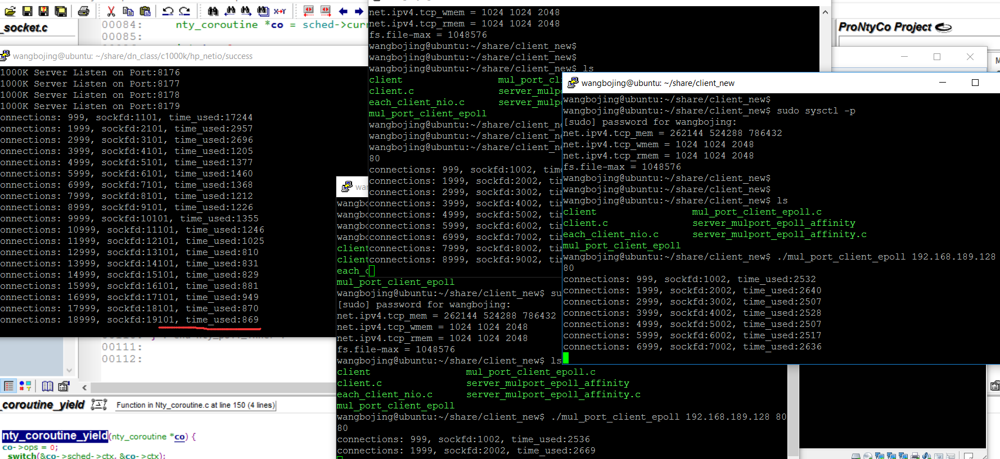
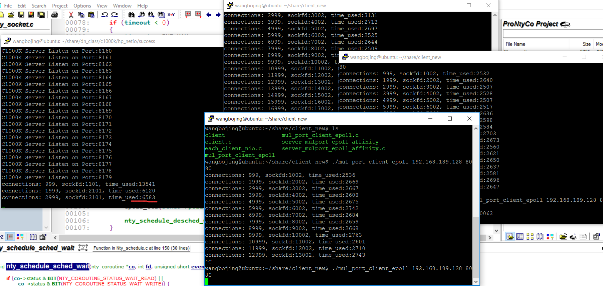

# 1.协程的起源

&emsp;&emsp;**问题：协程存在的原因？协程能够解决哪些问题？**

&emsp;&emsp;在我们现在CS，BS开发模式下，服务器的吞吐量是一个很重要的参数。其实吞吐量是IO处理时间加上业务处理。为了简单起见，比如，客户端与服务器之间是长连接的，客户端定期给服务器发送心跳包数据。客户端发送一次心跳包到服务器，服务器更新该新客户端状态的。心跳包发送的过程，业务处理时长等于IO读取（RECV系统调用）加上业务处理（更新客户状态）。吞吐量等于1s业务处理次数。


&emsp;&emsp;业务处理（更新客户端状态）时间，业务不一样的，处理时间不一样，我们就不做讨论。  

&emsp;&emsp;那如何提升recv的性能。若只有一个客户端，recv的性能也没有必要提升，也不能提升。若在有百万计的客户端长连接的情况，我们该如何提升。以Linux为例，在这里需要介绍一个“网红”就是epoll。服务器使用epoll管理百万计的客户端长连接，代码框架如下：
```
while (1) {
    int nready = epoll_wait(epfd, events, EVENT_SIZE, -1);

    for (i = 0;i < nready;i ++) {

        int sockfd = events[i].data.fd;
        if (sockfd == listenfd) {
            int connfd = accept(listenfd, xxx, xxxx);
            
            setnonblock(connfd);

            ev.events = EPOLLIN | EPOLLET;
            ev.data.fd = connfd;
            epoll_ctl(epfd, EPOLL_CTL_ADD, connfd, &ev);

        } else {
            handle(sockfd);
        }
    }
}
```  
&emsp;&emsp;对于响应式服务器，所有的客户端的操作驱动都是来源于这个大循环。来源于epoll_wait的反馈结果。
对于服务器处理百万计的IO。Handle(sockfd)实现方式有两种。

* handle(sockfd)函数内部对sockfd进行读写动作   

```
int handle(int sockfd) {

    recv(sockfd, rbuffer, length, 0);
    
    parser_proto(rbuffer, length);

    send(sockfd, sbuffer, length, 0);
    
}
```
* handle的io操作（send,recv）与epoll_wait是在同一个处理流程里面的。这就是IO同步操作。  
优点：  
1.sockfd管理方便。  
2.操作逻辑清晰。  
缺点：  
1.服务器程序依赖epoll_wait的循环响应速度慢。  
2.程序性能差  

* handle(sockfd)函数内部将sockfd的操作，push到线程池中:  

```  
int thread_cb(int sockfd) {
    // 此函数是在线程池创建的线程中运行。
    // 与handle不在一个线程上下文中运行
    recv(sockfd, rbuffer, length, 0);
    parser_proto(rbuffer, length);
    send(sockfd, sbuffer, length, 0);
}

int handle(int sockfd) {
    //此函数在主线程 main_thread 中运行
    //在此处之前，确保线程池已经启动。
    push_thread(sockfd, thread_cb); //将sockfd放到其他线程中运行。
}
```

&emsp;&emsp;Handle函数是将sockfd处理方式放到另一个已经其他的线程中运行，如此做法，将io操作（recv，send）与epoll_wait 不在一个处理流程里面，使得io操作（recv,send）与epoll_wait实现解耦。这就叫做IO异步操作。  
优点：  
1.子模块好规划。  
2.程序性能高。  
缺点：  
正因为子模块好规划，使得模块之间的sockfd的管理异常麻烦。每一个子线程都需要管理好sockfd，避免在IO操作的时候，sockfd出现关闭或其他异常。

&emsp;&emsp;**上文有提到IO同步操作，程序响应慢，IO异步操作，程序响应快。**

&emsp;&emsp;下面来对比一下IO同步操作与IO异步操作，代码如下：
[server_mulport_epool.c](https://github.com/wangbojing/c1000k_test/blob/master/server_mulport_epoll.c)
&emsp;&emsp;在这份代码的486行，#if 1, 打开的时候，为IO异步操作。关闭的时候，为IO同步操作。


&emsp;&emsp;接下来把我测试接入量的结果粘贴出来。
IO异步操作，每1000个连接接入的服务器响应时间（900ms左右）。

IO同步操作，每1000个连接接入的服务器响应时间（6500ms左右）。

epoll的IO异步操作与IO同步操作比较如下：  

   对比项    |   IO同步操作       |  IO异步操作
------------ | ------------------ | -----------------
Socket管理   |      管理方便      | 多个线程共同管理
 代码逻辑    |  程序整体逻辑清晰  | 子模块逻辑清晰
 IO性能      | 响应时间长，性能差 | 响应时间短，性能好

&emsp;&emsp;有没有一种方式，有异步性能，同步的代码逻辑。来方便编程人员对IO操作的组件呢？ 有，采用一种轻量级的协程来实现。在每次send或者recv之前进行切换，再由调度器来处理epoll_wait的流程。
就是采用了基于这样的思考，写了[NtyCo](https://github.com/wangbojing/NtyCo)，实现了一个IO异步操作与协程结合的组件。

