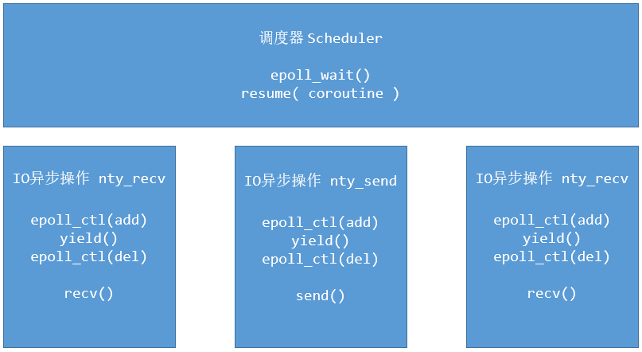
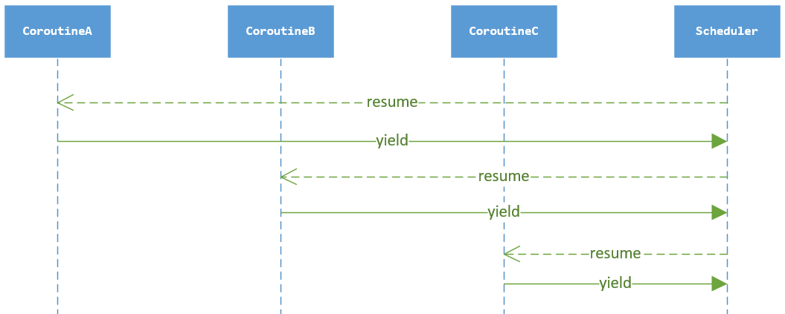

# 3.协程的实现之工作原理

* [前言](#1)
* [3.1.创建协程](#2)
* [3.2.实现IO异步操作](#3)
* [3.3.回调协程的子过程](#4)
<h3 id="1">前言</h3>
&emsp;&emsp;**问题：协程内部是如何工作呢？**  
&emsp;&emsp;先来看一下协程服务器案例的代码， 代码参考：  
&emsp;&emsp;[https://github.com/wangbojing/NtyCo/blob/master/nty_server_test.c](https://github.com/wangbojing/NtyCo/blob/master/nty_server_test.c)  
&emsp;&emsp;分别讨论三个协程的比较晦涩的工作流程。第一个协程的创建；第二个IO异步操作；第三个协程子过程回调。

<h3 id="2">3.1.创建协程</h3>  
&emsp;&emsp;当我们需要异步调用的时候，我们会创建一个协程。比如accept返回一个新的sockfd，创建一个客户端处理的子过程。再比如需要监听多个端口的时候，创建一个
server的子过程，这样多个端口同时工作的，是符合微服务的架构的。  
&emsp;&emsp;创建协程的时候，进行了如何的工作？创建API如下：
<table><tr><td bgcolor=silver>
int nty_coroutine_create(nty_coroutine \**new_co, proc_coroutine func, void *arg);
</td></tr></table>  
&emsp;&emsp;参数1：new_co，需要传入空的协程的对象，这个对象是由内部创建的，并且在函数返回的时候，会返回一个内部创建的协程对象。
&emsp;&emsp;参数2：func，协程的子过程。当协程被调度的时候，就会执行该函数。
&emsp;&emsp;参数3：arg，需要传入到新协程中的参数。
&emsp;&emsp;协程不存在亲属关系，都是一致的调度关系，接受调度器的调度。调用create API就会创建一个新协程，新协程就会加入到调度器的就绪队列中。创建的协程具体
步骤会在《协程的实现之原语操作》来描述。

<h3 id="3">3.2.实现IO异步操作</h3>
&emsp;&emsp;大部分的朋友会关心IO异步操作如何实现，在send与recv调用的时候，如何实现异步操作的。
&emsp;&emsp;先来看一下一段代码：  
```
while (1) {  
    int nready = epoll_wait(epfd, events, EVENT_SIZE, -1);

    for (i = 0;i < nready;i ++) {

        int sockfd = events[i].data.fd;
        if (sockfd == listenfd) {
            int connfd = accept(listenfd, xxx, xxxx);
            
            setnonblock(connfd);

            ev.events = EPOLLIN | EPOLLET;
            ev.data.fd = connfd;
            epoll_ctl(epfd, EPOLL_CTL_ADD, connfd, &ev);

        } else {
            
            epoll_ctl(epfd, EPOLL_CTL_DEL, sockfd, NULL);
            recv(sockfd, buffer, length, 0);

            //parser_proto(buffer, length);

            send(sockfd, buffer, length, 0);
            epoll_ctl(epfd, EPOLL_CTL_ADD, sockfd, NULL);
        }
    }
}
```  
&emsp;&emsp;在进行IO操作（recv，send）之前，先执行了 epoll_ctl的del操作，将相应的sockfd从epfd中删除掉，在执行完IO操作（recv，send）再进行epoll_ctl的add的动作。这段代码看起来似乎好像没有什么作用。  
&emsp;&emsp;如果是在多个上下文中，这样的做法就很有意义了。能够保证sockfd只在一个上下文中能够操作IO的。不会出现在多个上下文同时对一个IO进行操作的。协程的IO异步操作正式是采用此模式进行的。  
&emsp;&emsp;把单一协程的工作与调度器的工作的划分清楚，先引入两个原语操作 resume，yield会在《协程的实现之原语操作》来讲解协程所有原语操作的实现，yield就是让出运行，resume就是恢复运行。调度器与协程的上下文切换如下图所示：
  
在协程的上下文IO异步操作（nty_recv，nty_send）函数，步骤如下：
1.	将sockfd 添加到epoll管理中；
2.	进行上下文环境切换，由协程上下文yield到调度器的上下文；
3.	调度器获取下一个协程上下文。Resume新的协程。
IO异步操作的上下文切换的时序图如下：


<h3 id="4">3.3.回调协程的子过程</h3>  
&emsp;&emsp;在create协程后，何时回调子过程？何种方式回调子过程？  
&emsp;&emsp;首先来回顾一下x86_64寄存器的相关知识。汇编与寄存器相关知识还会在《协程的实现之切换》继续深入探讨的。x86_64 的寄存器有16个64位寄存器，分别是：%rax, %rbx，%rcx, %esi, %edi, %rbp, %rsp, %r8, %r9, %r10, %r11, %r12, %r13, %r14, %r15。

&emsp;&emsp;%rax 作为函数返回值使用的；  
&emsp;&emsp;%rsp 栈指针寄存器，指向栈顶；  
&emsp;&emsp;%rdi, %rsi, %rdx, %rcx, %r8, %r9  用作函数参数，依次对应第1参数，第2参数...  
&emsp;&emsp;%rbx, %rbp, %r12, %r13, %r14, %r15 用作数据存储，遵循调用者使用规则，换句话说，就是随便用。调用子函数之前要备份它，以防它被修改；  
&emsp;&emsp;%r10, %r11 用作数据存储，就是使用前要先保存原值

&emsp;&emsp;以NtyCo的实现为例，来分析这个过程。CPU有一个非常重要的寄存器叫做EIP，用来存储CPU运行下一条指令的地址。我们可以把回调函数的地址存储到EIP中，将相应的参数存储到相应的参数寄存器中。实现子过程调用的逻辑代码如下：  
```
void _exec(nty_coroutine *co) {
    co->func(co->arg); //子过程的回调函数
}

void nty_coroutine_init(nty_coroutine *co) {
    //ctx 就是协程的上下文
    co->ctx.edi = (void*)co; //设置参数
    co->ctx.eip = (void*)_exec; //设置回调函数入口
    //当实现上下文切换的时候，就会执行入口函数_exec , _exec 调用子过程func
}

```


